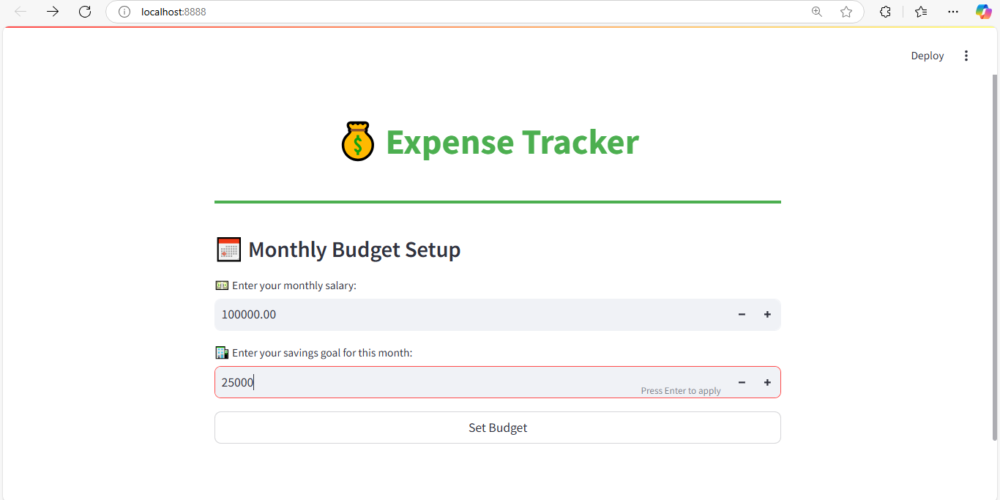
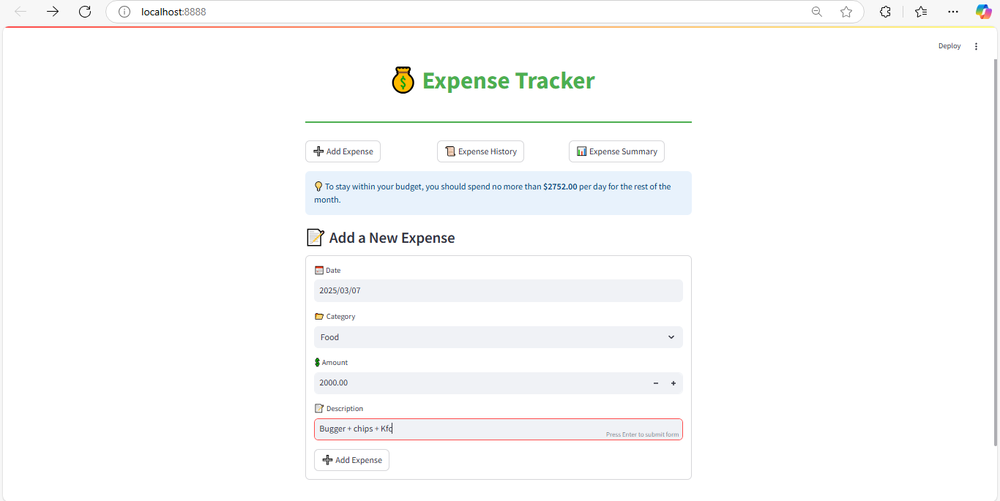
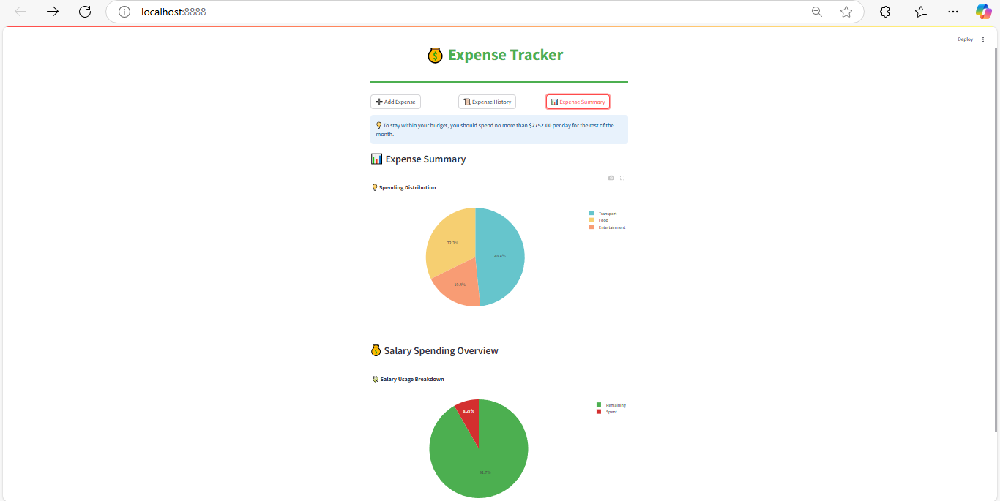

# Expense Tracker

## 📌 Overview
Expense Tracker is a user-friendly web application built using Streamlit that allows users to track their expenses, set monthly budgets, and visualize their spending habits with interactive charts.

## 🚀 Features
- **Set Monthly Budget**: Define your salary and savings goal.
- **Add Expenses**: Record your daily expenses with categories.
- **Expense History**: View all past expenses in a structured table.
- **Expense Summary**: Visualize spending habits using pie charts.
- **Dynamic Budgeting**: Get a suggested daily spending limit based on remaining funds.

## 🛠️ Installation
1. Clone the repository:
   ```sh
   git clone https://github.com/Shanmukhikoshireddy/expense-tracker.git
   ```
2. Navigate to the project folder:
   ```sh
   cd expense-tracker
   ```
3. Install dependencies:
   ```sh
   pip install -r requirements.txt
   ```

## ▶️ Usage
Run the application with the following command:
```sh
streamlit run app.py
```

## 📊 Screenshots
### 💰 Budget Setup


### 📜 Expense History


### 📊 Expense Summary


## 🤝 Contributing
1. Fork the repository.
2. Create a new branch (`feature-branch`).
3. Commit your changes.
4. Push the branch and create a pull request.

## 📄 License
This project is licensed under the MIT License.

## 📬 Contact
For any inquiries, reach out at [mail](mailto:manikantaharilakshmishanmukhik.com).


